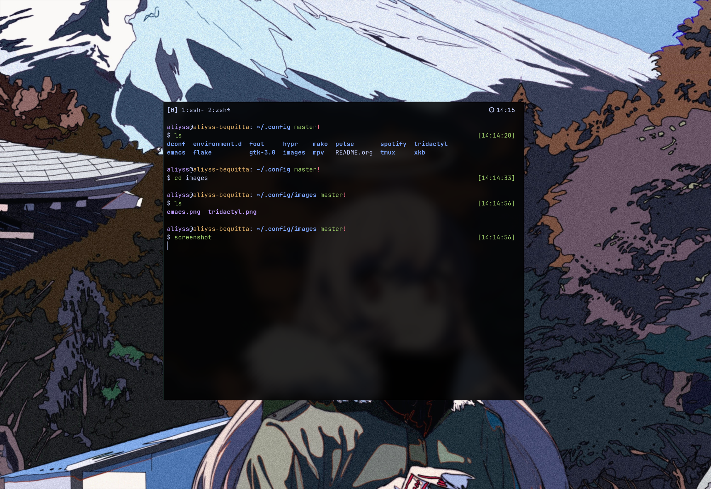
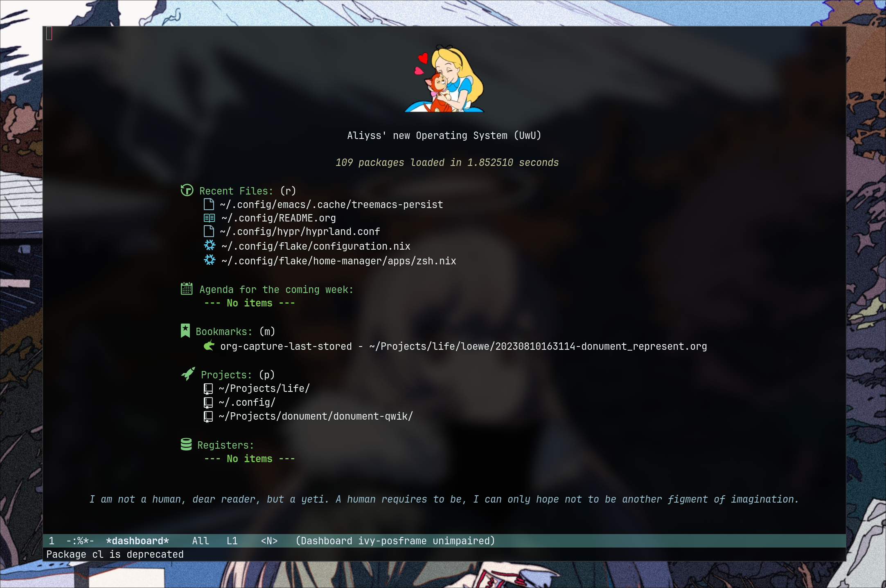
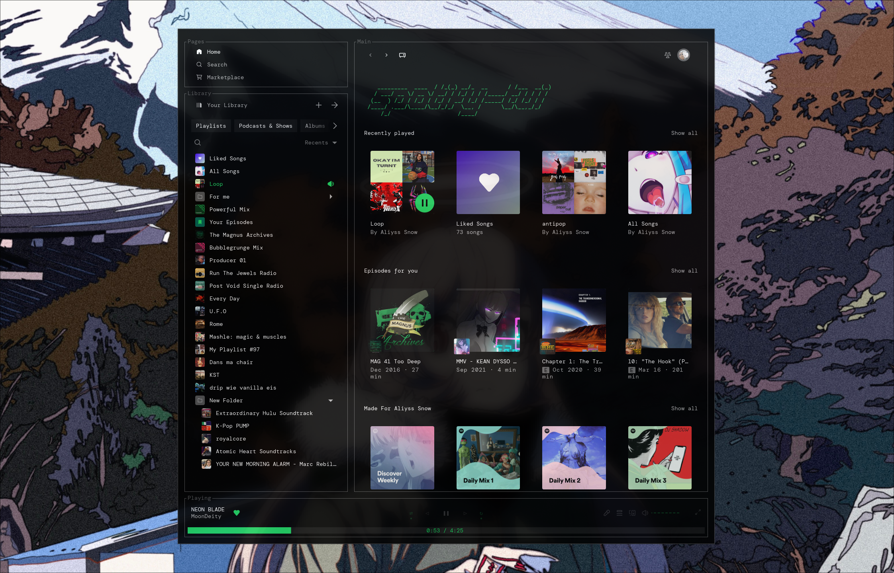
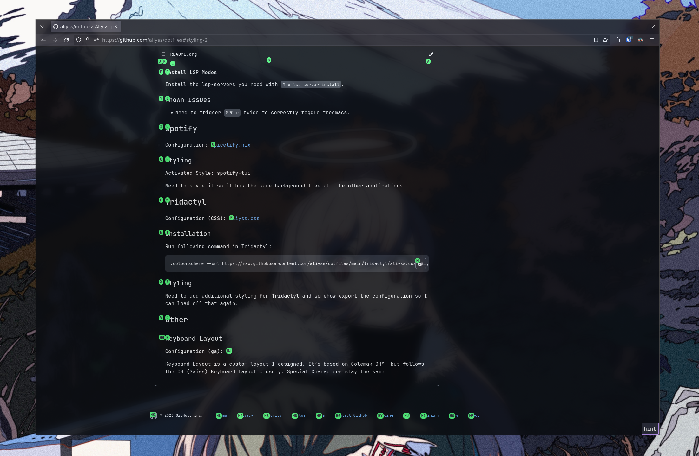

# aliyss' dotfiles

Welcome to my personal configuration repository! This is where I store my NixOS and Home Manager setups, along with various application configurations. It's a constant work in progress, stuck in that beautiful "configuration hell" we all know and love.

---

## Table of Contents
- [Installation](#installation)
  - [Operating System](#operating-system)
  - [Setup](#setup)
  - [Install](#install)
- [Configuration](#configuration)
  - [Flake](#flake)
  - [Herdr](#herdr)
  - [Phone Access](#phone-access)
  - [Hyprland](#hyprland)
  - [Foot](#foot)
  - [ZSH](#zsh)
  - [Emacs](#emacs)
  - [Neovim](#neovim)
  - [Spotify](#spotify)
  - [Tridactyl](#tridactyl)
- [Other](#other)
  - [Keyboard Layout](#keyboard-layout)

---

## Installation

### Operating System
I use **NixOS** to manage the core of my system. It provides a reproducible and reliable environment. Other configurations are also nested within this repository.

### Setup

To get started, clone the repository into your `.config` directory:

```bash
# Clone folder into .config directory
git clone https://github.com/aliyss/dotfiles temp
mkdir -p ~/.config
mv -v temp/* ~/.config

# Only use the following if you're aliyss (you're probably not, but who knows?)
mv -v temp/.git ~/.config/.git
mv -v temp/.gitignore ~/.config/.gitignore

# Cleanup
rm -rf temp
```

### Install

Once the files are in place, apply the configuration using the following commands:

```bash
# Update System (NixOS)
sudo nixos-rebuild switch --flake ~/.config/flake#aliyss-bequitta

# Update Home (Home Manager)
home-manager switch --flake ~/.config/flake#aliyss
```

Once you have done that you can now use this instead:

```bash
# Update System (NixOS)
update-system -s 'bequitta'

# Update Home (Home Manager)
update-home
```

---

## Configuration

### Flake
The heart of the Nix setup.
- **System Config:** [`flake/configuration.nix`](./flake/configuration.nix)
- **Home Manager Config:** [`flake/home-manager/home.nix`](./flake/home-manager/home.nix)

### Herdr
*Configuration:* [`flake/home-manager/apps/herdr.nix`](./flake/home-manager/apps/herdr.nix)

Herdr acts as a workspace manager and daemon. I use a Fish wrapper helper: `herdr-workspace "main"`. It starts the per-user herdr daemon on demand and lands the new shell on the `main` workspace. This is what every desktop pane and SSH session runs.
If I'm being honest... might switch back to tmux unless I can see the time somewhere in the top right soon.

### Hyprland
*Configuration:* [`hypr/hyprland.conf`](./hypr/hyprland.conf)

Nothing more to say.

### Foot
*Configuration:* [`foot/foot.ini`](./foot/foot.ini)

Foot is my terminal of choice for its excellent performance and transparency support. I've tried Alacritty and Kitty, but Foot is more my cup of tea.

### ZSH
*Configuration:* [`flake/home-manager/apps/zsh.nix`](./flake/home-manager/apps/zsh.nix)



Most of my terminal styling is managed here. I'm still tweaking what information to show or hide for that perfect minimalist look.

### Emacs
*Configuration:* [`emacs/config.org`](./emacs/config.org)

I switched from Neovim to Emacs. No regrets. Still stuck in the same configuration hell, though.



### Neovim
*Configuration:* [`flake/home-manager/apps/neovim.nix`](./flake/home-manager/apps/neovim.nix)

I switched back to Neovim. Again, no regrets. The configuration hell is eternal.

#### Troubleshooting
If **Semshi** starts complaining, run this command inside Neovim:
```vim
:UpdateRemotePlugins
```

### Spotify
*Configuration:* [`flake/home-manager/apps/spicetify.nix`](./flake/home-manager/apps/spicetify.nix)



I use Spicetify with the [text](https://github.com/spicetify/spicetify-themes/tree/master/text) theme. 
> **TODO:** Style it to match the background of all other applications.

### Tridactyl
*Configuration:* [`flake/home-manager/apps/firefox/extensions/tridactyl.nix`](./flake/home-manager/apps/firefox/extensions/tridactyl.nix)



Vim-like bindings for Firefox.
To install my theme, run this in Tridactyl:
```vim
:colourscheme --url https://raw.githubusercontent.com/aliyss/dotfiles/master/tridactyl/themes/aliyss.css aliyss
```

## Other

### Keyboard Layout
*Configuration:* [`xkb/symbols/ga`](./xkb/symbols/ga)

I designed a custom layout named **ga**. It's based on **Colemak DHM** but closely follows the **CH (Swiss)** layout for special characters, making it easier to switch between the two.
